# ⚡ RealRecon — Real-time Transaction Reconciliation Engine

> **Detect mismatches, auto-resolve errors, and gain full visibility into your payments — in seconds, not hours.**

---

## 📖 What is RealRecon?

Payment systems aren't just one computer talking to another. They are complex networks where **Users**, **Gateways**, and **Banks** all keep their own separate ledgers. RealRecon is the "source of truth" that listens to all of them in real-time to ensure they agree.

---

## 🏦 The Context: How Payment Systems Work

To understand why we built RealRecon, let's look at the lifecycle of a digital payment.

### The Simple Story
1.  **You** buy a coffee (₹100).
2.  The **Payment Gateway** asks the Bank "Is there money?"
3.  The **Bank** says "Yes" and moves the money.
4.  The App shows "Success".

### The Technical Reality (Where it gets messy)
Under the hood, this is an asynchronous distributed system:
*   **Authorization:** The Gateway gets a temporary "hold" on funds.
*   **Capture:** A separate event (often hours later) actually takes the money.
*   **Settlement:** Money moves between banks in batches (T+1 days).
*   **Webhooks:** The Gateway and Bank send messages (Events) to confirm these steps.

**Crucially, these events arrive at different times, in different formats, and sometimes not at all.**

---

## ⚠️ Why Problems Arise (Root Causes)

If everything worked perfectly, we wouldn't need reconciliation. But distributed systems are prone to entropy:

1.  **Asynchronous Architecture:** The Gateway might say "Success" now, but the Bank might say "Refused" 5 seconds later. If you miss that second message, you lose money.
2.  **Network Failures:** Webhooks get lost in transit.
3.  **Non-Uniform Data:** Gateway calls it `order_id`, Bank calls it `ref_num`.
4.  **Concurrency:** Events arrive out of order (e.g., "Refund" arriving before "Success").

**The Consequence:** Revenue leakage, angry customers, and hours of manual Excel work for Ops teams.

---

## 🛡 How These Problems Are Addressed Today

| Solution | How it works | The Downside |
| :--- | :--- | :--- |
| **Batch Reconciliation** | specific teams download CSVs at midnight and compare them. | **Too Slow.** You find errors 24 hours late. |
| **Enterprise Engines** | Tools like BlackLine or FIS. | **Expensive & Heavy.** Overkill for hackathons or agile startups. |
| **In-House Scripts** | Custom Python scripts run on cron jobs. | **Fragile.** Hard to maintain and scale. |

---

## 🚀 Our Approach: Why RealRecon is Better

We treat reconciliation as a **Real-Time Data Problem**, not a "end-of-day accounting problem".

### What We Built
*   **Event-First Architecture:** We ingest every signal (Gateway Webhook, Bank API, Ledger Update) as an immutable event.
*   **Unified Transaction Model:** We normalize diverse data shapes into a single standard schema.
*   **Deterministic State Machine:** We don't just "guess". We use a state machine (Start → Gateway_Ack → Bank_Ack → Match) to track lifecycle.

### Why It's Better
*   **Instant Observability:** You see the mismatch the second it happens.
*   **Auto-Remediation:** If the bank is silent, **RealRecon** automatically retries or replays the event. No human needed.
*   **Audit-Ready:** Every decision is logged. Perfect for compliance.

---

## 🔄 System Architecture

```mermaid
graph LR
    A[Customer Pays] -->|Event 1| B(Gateway)
    A -->|Event 2| C(Bank)
    
    B -->|Stream: gateway_txns| D{RealRecon Engine}
    C -->|Stream: bank_txns| D
    
    D -->|1. Normalize| D
    D -->|2. Match| E[✅ Matched]
    D -->|3. Check Timers| F[⚠️ Missing Event Alert]
    
    E --> G[Dashboard]
    F --> G
    
    style D fill:#f9f,stroke:#333,stroke-width:2px
    style E fill:#9f9,stroke:#333,stroke-width:2px
    style F fill:#f99,stroke:#333,stroke-width:2px
```

---

## ✨ Key Features (Feature Highlights)

*   **Ingestion:** Webhooks, Kafka, or Direct API.
*   **Matching Engine:** Deterministic (Transaction ID) + Fuzzy (Amount + Time Window).
*   **Smart Timers:** "If Bank doesn't ack in 60s, trigger alert."
*   **Forensic Replay:** Replay old events to debug specific transaction failures.

---

## 💻 Quick Start & Demo

### Tech Stack
*   **Backend:** Python (FastAPI)
*   **Stream:** Kafka / Redpanda
*   **Store:** PostgreSQL + Redis
*   **UI:** React + WebSocket

### Usage
1.  **Clone:** `git clone https://github.com/aadii-chavan/ReconFlow.git`
2.  **Run:** `docker compose up --build`
3.  **View:** Open `http://localhost:3000`

### Demo Scenarios to Try
1.  **Happy Path:** Run `python producers/happy_path.py` → See Green Check.
2.  **Missing Bank:** Run `python producers/missing_bank.py` → See Red Alert after 60s.
3.  **Mismatch:** Run `python producers/mismatch.py` → See Mismatch Warning.

---

## 📬 Contact

Built for **Tech Fiesta PICT**.
*   **GitHub:** [aadii-chavan/ReconFlow](https://github.com/aadii-chavan/ReconFlow)
