# ⚡ RealRecon — Real-time Transaction Reconciliation Engine

> **Detect mismatches, auto-resolve errors, and gain full visibility into your payments — in seconds, not hours.**


---

## 📖 What is RealRecon?

In the world of digital payments, money moves between multiple systems (Your App → Payment Gateway → Bank). Sometimes, these systems get out of sync. A customer might be charged, but the bank doesn't confirm it, or the gateway says "Failed" while the money is deducted.

**RealRecon** is an intelligent engine that watches these transactions in real-time. It acts as an unbiased referee, checking every payment event against bank records instantly to ensure everything adds up.

### The Problem vs. The Solution

| The Old Way (Batch Processing) ❌ | The RealRecon Way (Real-Time) ✅ |
| :--- | :--- |
| **Too Slow:** You find out about errors the next day. | **Instant:** Detects errors within seconds. |
| **Manual Work:** Teams spend hours checking excel sheets. | **Automated:** The system fixes common errors itself. |
| **Frustrated Users:** Customers wait days for refunds. | **Happy Users:** Issues are resolved before they notice. |

---

## 🔄 How It Works

Imagine a "Transaction" as a package traveling through checkpoints. RealRecon watches the checkpoints.


1.  **Ingest:** We listen to messages from payment gateways and banks.
2.  **Match:** We compare the ID, Amount, and Status of these messages.
3.  **Resolve:** If they match, great! If not, we start a timer. If the missing piece doesn't arrive, we alert you or auto-fix it.

---

## 🚀 Key Features

*   **⚡️ Instant Detection**
    Identify missing payments, duplicate charges, or amount discrepancies immediately as they happen.

*   **🤖 Auto-Resolution**
    Smart rules automatically retry failed checks or query the bank, reducing the need for manual intervention.

*   **📊 Live Dashboard**
    Watch your payment health in real-time. See transactions flow in, turn green (matched), or red (alert) instantly.

*   **🛡 Audit Trails**
    Every decision is logged. You have a permanent, unchangeable history of exactly what happened for every penny.

---

## 🏗 System Architecture (For Developers)

RealRecon is built on a modern, event-driven stack designed for speed and reliability.

```mermaid
sequenceDiagram
    participant U as User/App
    participant G as Gateway
    participant B as Bank
    participant R as RealRecon 🤖
    participant D as Dashboard 🖥️

    U->>G: Initiate Payment
    G->>R: Event: Payment Captured
    R->>D: Update: PENDING
    
    par Async Bank Process
        B->>B: Post Ledger Entry
        B->>R: Event: Ledger Posted
    end
    
    R->>R: Match (Gateway vs Bank)
    alt Match Successful
        R->>D: Update: ✅ MATCHED
    else Amount Mismatch
        R->>D: Update: ⚠️ MISMATCH
        R->>R: Trigger Alert / Auto-Retry
    end
```



### 🛠 Tech Stack

*   **Backend:** Python (FastAPI) for high-performance logic.
*   **Streaming:** Apache Kafka / Redpanda for handling massive event volumes.
*   **Database:** PostgreSQL (Audit) + Redis (Real-time State).
*   **Frontend:** React + Vite for the live operations dashboard.
*   **DevOps:** Docker Compose for one-click local deployment.

---

## 💻 Quick Start

Want to see it in action? You can run the entire system on your laptop.

### Prerequisites
*   [Docker Desktop](https://www.docker.com/products/docker-desktop/) installed.

### Installation

1.  **Clone the Repo**
    ```bash
    git clone https://github.com/aadii-chavan/ReconFlow.git
    cd ReconFlow
    ```

2.  **Run the System**
    ```bash
    cd infra
    docker compose up --build
    ```

3.  **Open the Dashboard**
    Go to `http://localhost:3000` in your browser.

4.  **Run a Demo Scenario**
    Open a new terminal and run the simulation scripts:
    ```bash
    # Verify a happy path transaction
    python producers/happy_path.py
    ```

---

## 📸 Demo Scenarios

We have prepared scripts to simulate real-world banking issues:

1.  **The Happy Path:** Everyone does their job. Gateway and Bank events arrive perfectly. -> **Status: MATCHED**
2.  **The "Missing Bank" Event:** The Gateway confirms, but the Bank is silent. -> **Status: ALERT (Bank Missing)**
3.  **The Amount Mismatch:** Gateway says ₹500, Bank says ₹450. -> **Status: MISMATCH (Check Logs)**

---

## � Contact & Support

Built for **Tech Fiesta PICT**.

*   **View Code:** [GitHub](https://github.com/aadii-chavan/ReconFlow)
*   **Team:** [Aditya Chavan](https://github.com/aadii-chavan)

---
*RealRecon — Because every transaction counts.*
